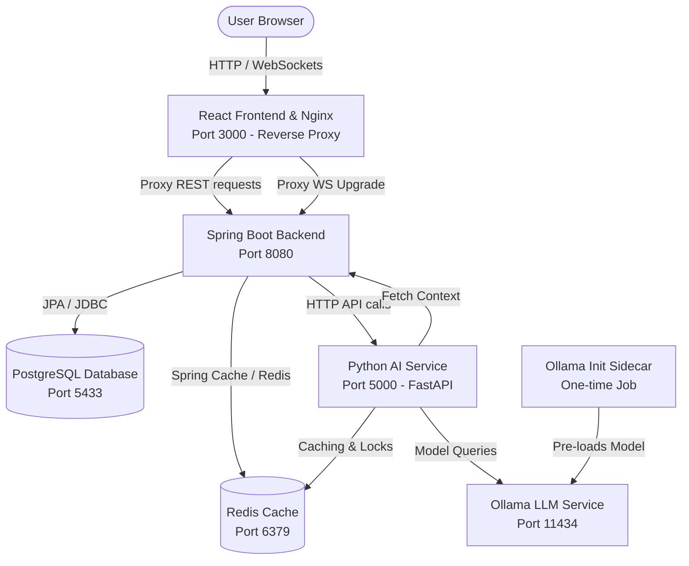
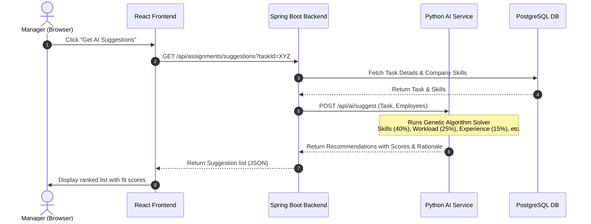
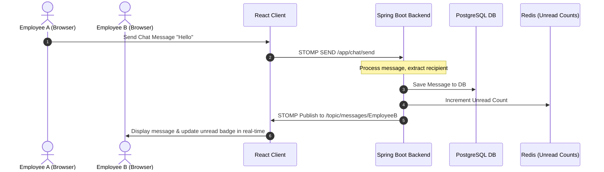
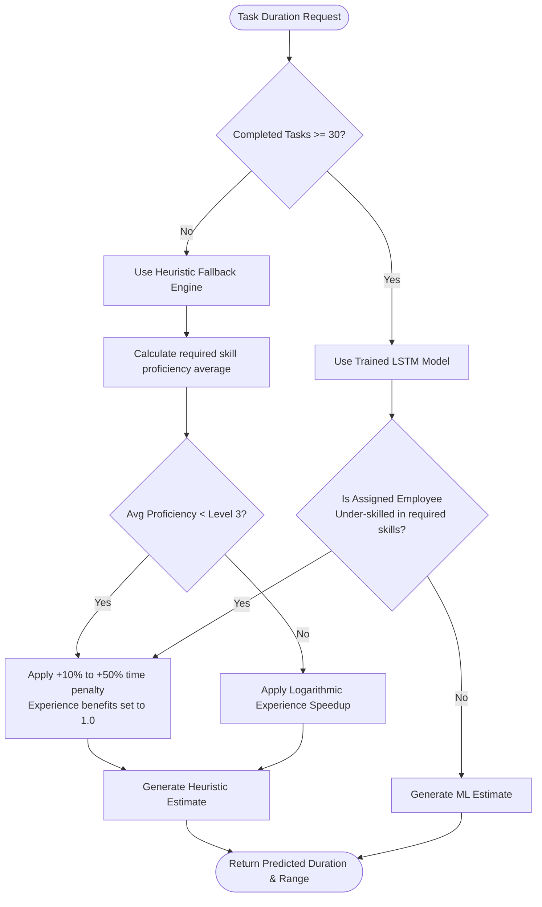

# Smart Resource Planner

An enterprise-grade, microservices-based resource planning and task management application featuring AI-powered task allocation suggestions, automatic skill extraction, real-time collaboration, and performance analytics.

---

## 🔒 Evaluation Guidelines

This repository is private proprietary software. It is provided strictly for **viewing and evaluation purposes** (e.g., as part of a professional portfolio).

### Exploring the Project:
* **Codebase**: You are welcome to browse the repository source files and inspect the commit history directly in the interface.
* **Evaluation Rights**: Under the terms of the [LICENSE](file:///c:/Users/Takis/Desktop/thesis/LICENSE), cloning, copying, distributing, modifying, or using this codebase in other commercial/non-commercial projects is prohibited without explicit prior consent.

---

## 🏗️ System Architecture & Deployment

The application is built using a containerized microservices architecture utilizing the following core deployment patterns:

### 1. 🔀 Nginx Reverse Proxy & API Gateway
Nginx runs inside the frontend container to act as a **Reverse Proxy / API Gateway**:
* **Unified Port Access**: External clients connect directly to port `3000`. 
* **Routing Rules**: Nginx serves the React Single Page Application (SPA) static files directly. Any requests containing `/api/` or `/ws` (WebSockets) are transparently proxied to the Java Spring Boot service (`http://backend:8080`), resolving issues related to Cross-Origin Resource Sharing (CORS).
* **Performance**: Handles gzip compression and asset caching to optimize page load speeds.

### 2. 🛞 Sidecar Pattern (Ollama Initialization)
We use a **one-shot initialization sidecar container (`ollama_init`)** to bootstrap the AI infrastructure:
* **Dynamic Model Preloading**: The local Ollama LLM service runs as a main backend service. Since large language models (like `phi3`) must be manually pulled from the registry, the `ollama_init` container runs as a dependency sidecar.
* **Lifecycle Flow**: It waits for the main Ollama service to report healthy, checks if the `phi3` model is already cached locally, automatically downloads it if missing, verifies model load state, and then exits, allowing the backend services to connect safely.

---

## 🌟 Application Features

### 1. User & Access Control (RBAC)
* **What it does**: Restricts system actions based on user roles (`ADMIN`, `MANAGER`, `EMPLOYEE`, `USER`).
* **Implementation Details**: Managers view team performance, employees log hours and update task progress, and administrators configure system settings. Managed via secure Spring Security JWT filters and frontend Route Guards.

### 2. Organization, Department & Team Management
* **What it does**: Houses multi-tenant organization workspaces, organizational units, and cross-functional teams.
* **Implementation Details**: Tracks joining links, coordinates departmental membership, and aggregates chat/assignment flows by team.

### 3. Task Management & Board Workflows
* **What it does**: Tracks task creation, priorities, complexities, assigned employees, required skills, and status states (PENDING, IN_PROGRESS, COMPLETED, BLOCKED, CANCELLED).
* **Implementation Details**: Kanban drag-and-drop boards visualise states. Auditing listeners capture historical edits (who edited, what changed, old vs new values) for detailed compliance logging.

### 4. AI-Powered Team Allocation Suggestions
* **What it does**: Recommends the optimal employees for any task at the click of a button.
* **Implementation Details**: Matches tasks to employees by analyzing skill alignment, current workload, experience, adaptability, and priority. Uses a custom Genetic Algorithm constraint solver in the AI Service.

### 5. AI Task Duration Prediction
* **What it does**: Automatically predicts the estimated time needed for tasks during creation.
* **Implementation Details**: Returns an estimated hour count and confidence range based on required skills and assignee profile details. Uses online incremental regressors (`warm_start=True`) with a robust mathematical fallback safety engine.

### 6. AI-Powered Skill Auto-Detection (NLP)
* **What it does**: Automatically extracts required skills from task titles and descriptions.
* **Implementation Details**: Uses a BERT-based `sentence-transformers` model to calculate cosine semantic similarities against a taxonomy. Simultaneously parses contextual phrases (e.g., "requires expert knowledge", "basic understanding") using `spaCy` to suggest target proficiency levels (1 to 5) automatically.

### 7. Dynamic Capacity Planning & Workload Balancing
* **What it does**: Categorizes employees into load bands (`UNDERLOADED`, `OPTIMAL`, `OVERLOADED`) based on their aggregate active task workload.
* **Implementation Details**: Prevents manager bias and workload fatigue by dynamically updating load metrics and prioritizing optimal utilization in allocation suggestions.

### 8. Real-Time Chat & Multi-Channel Notifications
* **What it does**: Enables team members to chat in direct messaging channels or shared team rooms, with unread notifications.
* **Implementation Details**: Real-time messaging updates unread message counts instantly and triggers alerts for new messages. Handles message routing via WebSockets and STOMP sub-queues.

### 9. Asynchronous Transactional Email Security Alerts
* **What it does**: Dispatches real-time security email alerts when critical company configuration changes.
* **Implementation Details**: Uses the **Brevo (Sendinblue) API** asynchronously inside Spring Boot backend to email company owners instantly when access join codes are regenerated.

### 10. Management Dashboards & Observability
* **What it does**: Visualizes team productivity, department stats, and system performance.
* **Implementation Details**: Renders workload distributions and completion velocity using Recharts, backed by Prometheus metric exports.

---

## 🛠️ Technology Stack

| Service | Technology / Library | Description |
| :--- | :--- | :--- |
| **Frontend** | React 18 | Client-side user interface library |
| | TypeScript | Strongly-typed JavaScript layer |
| | Vite | Fast front-end tooling and bundler |
| | Tailwind CSS | Utility-first styling framework |
| | Recharts | Composable charting library for analytics |
| | SockJS / StompJS | WebSocket client library for real-time chat |
| **Backend** | Java 17 / Spring Boot 3 | Core application backend framework |
| | Spring Security | Access control and security framework |
| | JWT (JSON Web Tokens) | Stateless authentication tokens |
| | Spring Data JPA / Hibernate | Object-Relational Mapping (ORM) and DB access |
| | Maven | Dependency management and build tool |
| | Brevo API | Transactional email delivery integration |
| **AI Service** | Python 3.9 / FastAPI | High-performance asynchronous API framework |
| | Gunicorn / Uvicorn | ASGI server for production deployment |
| | Scikit-Learn | Machine learning (linear regression models) |
| | Sentence-Transformers | BERT-based embedding model (`all-MiniLM-L6-v2`) |
| | SpaCy | NLP entity and text parsing (`en_core_web_sm`) |
| | Httpx | Asynchronous HTTP client with connection pooling |
| **Storage & Cache**| PostgreSQL 16 | Core relational database |
| | Redis 7 | High-performance caching & locking store |
| **Observability**| Prometheus | System metrics collection and storage |
| | Grafana | Dashboard visualization interface |
| | Actuator | Spring Boot application monitoring endpoints |

---

## 📐 Design & Architectural Patterns

The project leverages industry-standard software engineering patterns to ensure maintainability, scalability, and loose coupling:

### 1. Architectural Patterns
* **Microservices Architecture**: The system is split into independent domains (Frontend, Core Backend, AI Engine, Database, Cache, LLM) communicating via standard REST APIs and WebSockets.
* **API Gateway & Reverse Proxy**: Nginx routes all external traffic. Clients interact with a single port (`3000`), routing static page requests locally, and proxying `/api/` or `/ws` calls to the Spring Boot application.
* **Publish-Subscribe (Pub/Sub)**: Used in the WebSockets implementation (via STOMP) where the backend broker pushes chat and notification updates to client-subscribed topic channels (e.g. `/topic/messages/{userId}`).
* **Three-Tier Layered Architecture (Backend)**: Decouples layers into:
  1. *Presentation Layer* (`Controller`): Exposes REST endpoints.
  2. *Business Logic Layer* (`Service`): Houses domain logic and transaction scopes.
  3. *Data Access Layer* (`Repository`): Executes database commands.

### 2. Design Patterns
* **Strategy Pattern (Fallback Mechanism)**:
  * Used in the AI Service to predict task durations. The system evaluates completed data. If enough task history is present ($\ge 30$ completed tasks), it executes the **Machine Learning Model Strategy**; otherwise, it falls back to the **Heuristic Math Strategy**.
* **Observer Pattern (Auditing & Context)**:
  * **JPA Entity Listeners**: `@EntityListeners(TaskAuditListener.class)` listens for database changes on the `Task` entity, automatically creating history records in `TaskAuditLog` without polluting business code.
  * **React Context Providers**: `AuthContext` and `SocketContext` act as observers, pushing user-state and socket-connection updates to all listening UI pages.
* **Singleton Pattern**:
  * **Spring IoC Container**: Spring manages controllers, services, and repositories as Singleton Beans by default, ensuring efficient memory usage.
  * **Python Client Pools**: Both `BackendClient` (HTTP) and `RedisClient` (Cache) maintain persistent singletons managing connection pooling.
* **Repository Pattern**: Spring Data JPA repositories abstract database SQL operations behind generic Java interfaces (e.g. `UserRepository` extending `JpaRepository<User, UUID>`).
* **Data Transfer Object (DTO) Pattern**: Request and Response bodies are decoupled from PostgreSQL schemas using DTOs (e.g., `TaskDTO`, `SkillExtractionResponse`). This protects database structures from being exposed directly to the REST API.
* **State Pattern**: The `Task` entity transitions through distinct status states (`PENDING` $\to$ `IN_PROGRESS` $\to$ `COMPLETED`), enforcing strict rules for lifecycle progression.
* **Interceptor / Middleware Pattern**:
  * **FastAPI**: SlowAPI middleware implements rate-limiting.
  * **React**: Axios request/response interceptors automatically attach JWT bearer headers and catch 401 expiration signals to refresh tokens transparently.

---

## 📊 Process Sequence & Decision Flows

### 1. AI Employee Allocation Recommendation Flow
This sequence shows how the system scores and suggests candidates for a task:

### 2. WebSocket Real-Time Chat Flow
This sequence details how live messaging is routed using the WebSocket STOMP broker:

### 3. AI Task Duration Strategy Selection
This flowchart details how the AI Service selects its estimation strategy and applies rules:

---

## 📄 License

Proprietary License. Copyright (c) 2026 Panagiotis Papatheodoropoulos. All rights reserved. 

The software and all associated files are provided strictly for viewing and evaluation purposes. You are not permitted to copy, modify, distribute, or use this code for any other projects without explicit, prior written consent from the copyright holder. See the [LICENSE](file:///c:/Users/Takis/Desktop/thesis/LICENSE) file for the full proprietary terms and restrictions.

---

## 🧮 Appendix: AI Duration Heuristics

For technical reviewers interested in the underlying mathematical calculations for task duration predictions:

$$\text{Predicted Duration} = \text{Baseline Duration} \times \text{Skill Factor} \times \text{Experience Factor} \times \text{Priority Modifier}$$

* **Skill Factor**:
  * Workers meeting task requirements get standard or reduced factors.
  * Under-skilled workers (Level 1/2 in required skills) receive a penalty multiplier ($+30\%$ for Level 1, $+10\%$ for Level 2, $+50\%$ for missing required skills).
* **Experience Factor**:
  * For proficient workers: $\text{Factor} = 1.0 - 0.15 \times \ln(\text{Experience Years} + 1)$.
  * For under-skilled workers: $\text{Factor} = 1.0$ (experience benefits are nullified).
* **Safety Guard**: If predicted duration falls below the baseline due to a machine learning model swing but the worker is under-skilled, the system automatically overrides the prediction to apply the skill penalty.